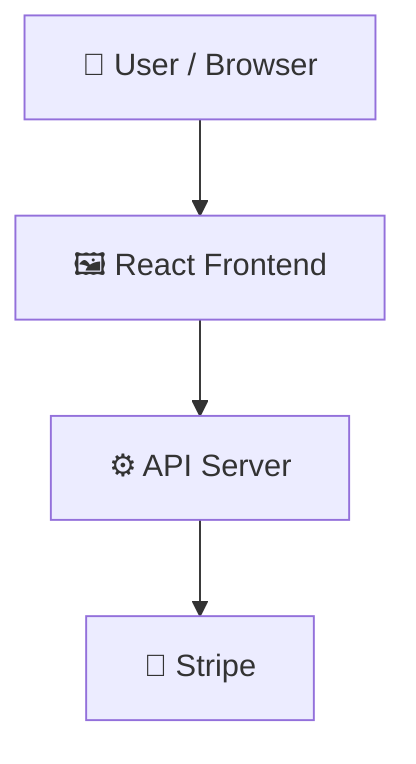

# ShopMate

> Full-stack e-commerce web application built with React, Node.js, and Stripe.

    

## 📑 Table of Contents

- [Description](#description)
- [Key Features](#key-features)
- [Use Cases](#use-cases)
- [Screenshots](#screenshots)
- [Tech Stack](#tech-stack)
- [Architecture](#architecture)
- [Quick Start](#quick-start)
- [Key Dependencies](#key-dependencies)
- [Available Scripts](#available-scripts)
- [API Endpoints](#api-endpoints)
- [Project Structure](#project-structure)
- [Development Setup](#development-setup)
- [Deployment](#deployment)
- [Contributors](#contributors)
- [Contributing](#contributing)

## 📝 Description

ShopMate is a full-stack web application designed for online commerce, digital store management, and payment processing. Grounded in the MERN tech stack, the platform coordinates customer interactions on the frontend with backend services and database operations. The client application is built with React and Vite, utilizing Redux for centralized state management, Tailwind CSS for styling, and Framer Motion for interactive UI components. The Node.js backend initializes database connections, provisions system tables automatically at launch, manages Cloudinary media integrations, and processes user payments via Stripe. This architecture serves as a foundation for developers looking to deploy or customize a complete full-stack web application with dedicated frontend, backend, and dashboard modules.

## ✨ Key Features

- **🛒 Redux Client State Management** — Manages frontend state across React components using Redux and Redux Store.
- **💳 Stripe Payment Processing** — Handles secure transaction capabilities through Stripe integration.
- **☁️ Cloudinary Media Management** — Configures Cloudinary API credentials on the server for cloud-based media asset handling.
- **🎨 Tailwind and Framer Motion** — Delivers responsive styling using Tailwind CSS and interactive UI animations with Framer Motion.
- **🗄️ Automated Database Table Creation** — Connects to the backend database and automatically creates necessary tables upon server initialization.

## 🎯 Use Cases

- Building and deploying a full-stack e-commerce store with integrated payment gateways.
- Serving as a reference architecture for React, Redux, and Express application integration.
- Managing digital store assets and media uploads through Cloudinary API integration.

## 📸 Screenshots

## Home-Page(with chatbot)


## Recently - Visited Products


## Testimonials & Stay-In-Loop


## Products page


## AI - Search


## SideBar with Profile pannel


## My Order


## Payment 


## Admin-Panel


## Product - Management


## 🛠️ Tech Stack

    

**Notable libraries:** Framer Motion, Redux, Stripe

## 🏗️ Architecture

A high-level view of how the main pieces fit together:



## ⚡ Quick Start

```bash

# 1. Clone the repository
git clone https://github.com/Ujjwal092/ShopMate.git

# 2. Install dependencies
npm install

# 3. Start the dev server
npm run dev
```

## 📦 Key Dependencies

```
@n8n/chat: ^1.7.1
@reduxjs/toolkit: ^2.11.2
@stripe/react-stripe-js: ^5.6.0
@stripe/stripe-js: ^8.7.0
axios: ^1.13.4
framer-motion: ^12.31.1
jspdf: ^4.2.1
lucide-react: ^0.563.0
motion: ^12.34.0
react: ^19.2.4
react-countup: ^6.5.3
react-dom: ^19.2.4
react-hook: ^0.0.1
react-redux: ^9.2.0
react-router-dom: ^7.13.0
```

## 🚀 Available Scripts

- **dev** — `npm run dev`
- **build** — `npm run build`
- **lint** — `npm run lint`
- **preview** — `npm run preview`

## 🌐 API Endpoints

Detected endpoints (best-effort scan):

```
POST /api/v1/payment/webhook
```

## 📁 Project Structure

```
.
├── Client
│   ├── eslint.config.js
│   ├── index.html
│   ├── package.json
│   ├── postcss.config.js
│   ├── public
│   │   ├── Cart.gif
│   │   ├── avatar-holder.avif
│   │   ├── electronics.jpg
│   │   ├── fashion.jpg
│   │   ├── favicon.jpg
│   │   ├── furniture.jpg
│   │   └── vite.svg
│   ├── src
│   │   ├── App.css
│   │   ├── App.jsx
│   │   ├── assets
│   │   │   ├── place-holder.jpg
│   │   │   ├── react.svg
│   │   │   └── sorryProd.png
│   │   ├── components
│   │   │   ├── Home
│   │   │   │   ├── CategoryGrid.jsx
│   │   │   │   ├── FeatureSection.jsx
│   │   │   │   ├── HeroSlider.jsx
│   │   │   │   ├── ImpactSection.jsx
│   │   │   │   ├── LazyImage.jsx
│   │   │   │   ├── NewsletterSection.jsx
│   │   │   │   ├── ProductSlider.jsx
│   │   │   │   ├── PromoStrip.jsx
│   │   │   │   ├── RecentlyViewed.jsx
│   │   │   │   └── TestimonialCarousel.jsx
│   │   │   ├── Layout
│   │   │   │   ├── CartSidebar.jsx
│   │   │   │   ├── ChatBot.jsx
│   │   │   │   ├── Footer.jsx
│   │   │   │   ├── LoginModal.jsx
│   │   │   │   ├── Navbar.jsx
│   │   │   │   ├── ProfilePanel.jsx
│   │   │   │   ├── SearchOverlay.jsx
│   │   │   │   └── Sidebar.jsx
│   │   │   ├── PaymentForm.jsx
│   │   │   └── Products
│   │   │       ├── AISearchModal.jsx
│   │   │       ├── Pagination.jsx
│   │   │       ├── ProductCard.jsx
│   │   │       ├── ReviewsContainer.jsx
│   │   │       ├── Similarproducts.jsx
│   │   │       └── WishlistButton.jsx
│   │   ├── contexts
│   │   │   └── ThemeContext.jsx
│   │   ├── data
│   │   │   └── products.js
│   │   ├── index.css
│   │   ├── lib
│   │   │   ├── abTest.js
│   │   │   ├── axios.js
│   │   │   ├── currency.js
│   │   │   └── recentlyViewed.js
│   │   ├── main.jsx
│   │   ├── pages
│   │   │   ├── About.jsx
│   │   │   ├── Cart.jsx
│   │   │   ├── Contact.jsx
│   │   │   ├── FAQ.jsx
│   │   │   ├── Home.jsx
│   │   │   ├── NotFound.jsx
│   │   │   ├── OrderDetails.jsx
│   │   │   ├── Orders.jsx
│   │   │   ├── Payment.jsx
│   │   │   ├── ProductDetail.jsx
│   │   │   ├── Products.jsx
│   │   │   ├── Testimonials.jsx
│   │   │   └── Wishlist.jsx
│   │   ├── store
│   │   │   ├── slices
│   │   │   │   ├── authSlice.js
│   │   │   │   ├── cartSlice.js
│   │   │   │   ├── orderSlice.js
│   │   │   │   ├── popupSlice.js
│   │   │   │   ├── productSlice.js
│   │   │   │   └── wishlistSlice.js
│   │   │   └── store.js
│   │   └── toast.css
│   ├── tailwind.config.js
│   └── vite.config.js
├── Server
│   ├── Dockerfile
│   ├── app.js
│   ├── babel.config.json
│   ├── config
│   │   └── swagger.js
│   ├── controllers
│   │   ├── adminController.js
│   │   ├── authController.js
│   │   ├── contactController.js
│   │   ├── newsletterController.js
│   │   ├── orderController.js
│   │   ├── productController.js
│   │   ├── stockAlertController.js
│   │   ├── testStockAlertController.js
│   │   ├── testimonialController.js
│   │   └── wishlistController.js
│   ├── database
│   │   └── db.js
│   ├── jest.config.js
│   ├── loadtest.js
│   ├── middlewares
│   │   ├── authMiddleware.js
│   │   ├── catchAsyncError.js
│   │   ├── errorMiddleware.js
│   │   └── rateLimit.js
│   ├── models
│   │   ├── contactModel.js
│   │   ├── newsletterModel.js
│   │   ├── orderItemsTable.js
│   │   ├── ordersTable.js
│   │   ├── paymentsTable.js
│   │   ├── productReviewsTable.js
│   │   ├── productTable.js
│   │   ├── shippinginfoTable.js
│   │   ├── stockAlertModel.js
│   │   ├── testimonialModel.js
│   │   ├── userTable.js
│   │   └── wishlistModel.js
│   ├── package.json
│   ├── routes
│   │   ├── adminRoutes.js
│   │   ├── authRoutes.js
│   │   ├── contactRoutes.js
│   │   ├── newsletterRoutes.js
│   │   ├── orderRoutes.js
│   │   ├── productRoutes.js
│   │   ├── stockAlertRoutes.js
│   │   ├── testRoutes.js
│   │   ├── testimonialRoutes.js
│   │   └── wishlistRoutes.js
│   ├── server.js
│   ├── tests
│   │   ├── auth.test.js
│   │   ├── middleware.test.js
│   │   ├── order.test.js
│   │   ├── product.test.js
│   │   └── setupTests.js
│   ├── uploads
│   │   ├── tmp-1-108401781418450091
│   │   ├── tmp-1-295521781434867499
│   │   ├── tmp-1-501441781344816163
│   │   ├── tmp-2-108401781418521250
│   │   ├── tmp-3-108401781418525342
│   │   ├── tmp-4-108401781419132602
│   │   └── tmp-5-108401781419195357
│   └── utils
│       ├── createTables.js
│       ├── generateContactFormEmailTemplate.js
│       ├── generateForgotPasswordEmailTemplate.js
│       ├── generatePaymentIntent.js
│       ├── generateResetPasswordToken.js
│       ├── generateStockAlertEmailTemplate.js
│       ├── getAIRecommendation.js
│       ├── jwtToken.js
│       ├── knnRecommendation.js
│       └── sendEmail.js
└── dashboard
    ├── eslint.config.js
    ├── index.html
    ├── package.json
    ├── postcss.config.js
    ├── public
    │   ├── favicon.jpg
    │   └── vite.svg
    ├── src
    │   ├── App.jsx
    │   ├── assets
    │   │   ├── avatar.jpg
    │   │   ├── laptop.webp
    │   │   ├── pic.webp
    │   │   └── react.svg
    │   ├── components
    │   │   ├── Dashboard.jsx
    │   │   ├── Header.jsx
    │   │   ├── Orders.jsx
    │   │   ├── Products.jsx
    │   │   ├── Profile.jsx
    │   │   ├── SideBar.jsx
    │   │   ├── Users.jsx
    │   │   └── dashboard-components
    │   │       ├── MiniSummary.jsx
    │   │       ├── MonthlySalesChart.jsx
    │   │       ├── OrdersChart.jsx
    │   │       ├── Stats.jsx
    │   │       ├── TopProductsChart.jsx
    │   │       └── TopSellingProducts.jsx
    │   ├── index.css
    │   ├── lib
    │   │   ├── axios.js
    │   │   └── helper.js
    │   ├── main.jsx
    │   ├── modals
    │   │   ├── CreateProductModal.jsx
    │   │   ├── UpdateProductModal.jsx
    │   │   └── ViewProductModal.jsx
    │   ├── pages
    │   │   ├── ForgotPassword.jsx
    │   │   ├── Login.jsx
    │   │   └── ResetPassword.jsx
    │   └── store
    │       ├── slices
    │       │   ├── adminSlice.js
    │       │   ├── authSlice.js
    │       │   ├── extraSlice.js
    │       │   ├── orderSlice.js
    │       │   └── productsSlice.js
    │       └── store.js
    ├── tailwind.config.js
    └── vite.config.js
```

## 🛠️ Development Setup

### Node.js / JavaScript
1. Install Node.js (v18+ recommended)
2. Install dependencies: `npm install` (or `yarn` / `pnpm install` / `bun install`)
3. Start the dev server: see the **Quick Start** above

### Docker
1. `docker build -t my-app .`
2. `docker run -p 3000:3000 my-app`

## 🚢 Deployment

### Docker
```bash
docker build -t shopmate .
docker run -p 3000:3000 shopmate
```

> ⚙️ CI/CD is configured via GitHub Actions (see `.github/workflows/`).

## 👥 Contributors

Thanks to everyone who has contributed to this project:

<p align="left">
<a href="https://github.com/Ujjwal092" title="Ujjwal092"></a>
</p>

[See the full list of contributors →](https://github.com/Ujjwal092/ShopMate/graphs/contributors)

## 👥 Contributing

Contributions are welcome! Here's the standard flow:

1. **Fork** the repository
2. **Clone** your fork: `git clone https://github.com/Ujjwal092/ShopMate.git`
3. **Branch**: `git checkout -b feature/your-feature`
4. **Commit**: `git commit -m 'feat: add some feature'`
5. **Push**: `git push origin feature/your-feature`
6. **Open** a pull request

Please follow the existing code style and include tests for new behavior where applicable.

---

<div align="center">

[](https://readmebuddy.com)

<sub>Generate beautiful READMEs in seconds → <a href="https://readmebuddy.com">readmebuddy.com</a></sub>

</div>
